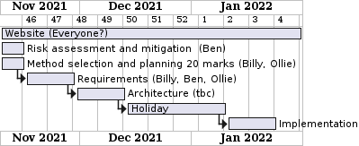
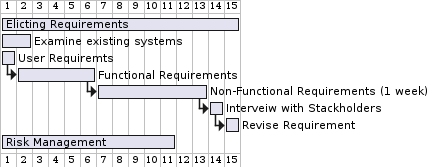
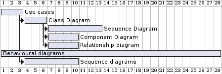

# Project Brief
It seems to be a quiet day at the Piazza: there aren't that many students and staff around 
this time of the year, so most of the kitchen staff are away on leave - you only have three
cooks. Suddenly, a crowd bursts into the restaurant: it's an open day, and they all want to eat
at once! Make the most of your kitchen and your staff, and face up to the challenge of
serving an impatient and demanding crowd!
This is a single player game that requires managing staff around the a busy kitchen, who will be preparing
various dishes requested by customers coming to the Piazza Resturent Restaurant.

# Project Planning

This is are current project overview

## Project Gantt Chart

## Elicting Requirement Gantt Chart

## Architecture Gantt Chart

