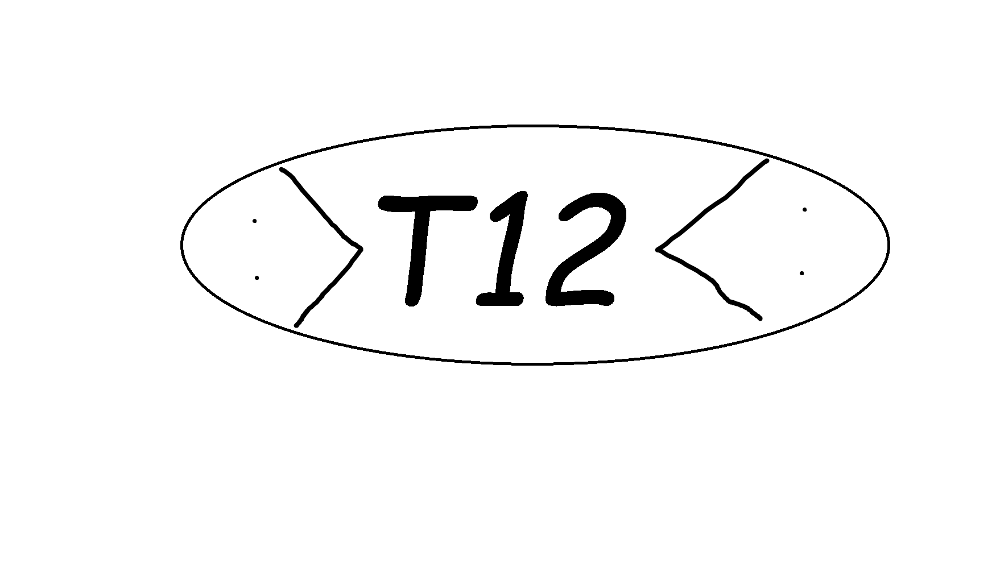

# Identity

This is T12.

## Potential Resources

[Github](https://github.com/) - Collaborative code development.

[LibGDX](https://libgdx.com/wiki/) - Java game development framework, got some good documentation and other groups will use it.

[OpenGameArt](https://opengameart.org/latest) - A place where you can get free game art.

[Piskel](https://www.piskelapp.com/) - A free site that allows user to create sprites and pixelart. 

[Iterative development](https://en.wikipedia.org/wiki/Iterative_and_incremental_development) & [PDD](https://www.geeksforgeeks.org/overview-of-plan-driven-development-pdd/) - Different perspectives and approaches to program development.

[diagrams.net](https://app.diagrams.net/) - Used to create both flow charts and class diagrams.

[PlantUML](https://github.com/plantuml/plantuml) - Generating Gannt diagrams through code.
